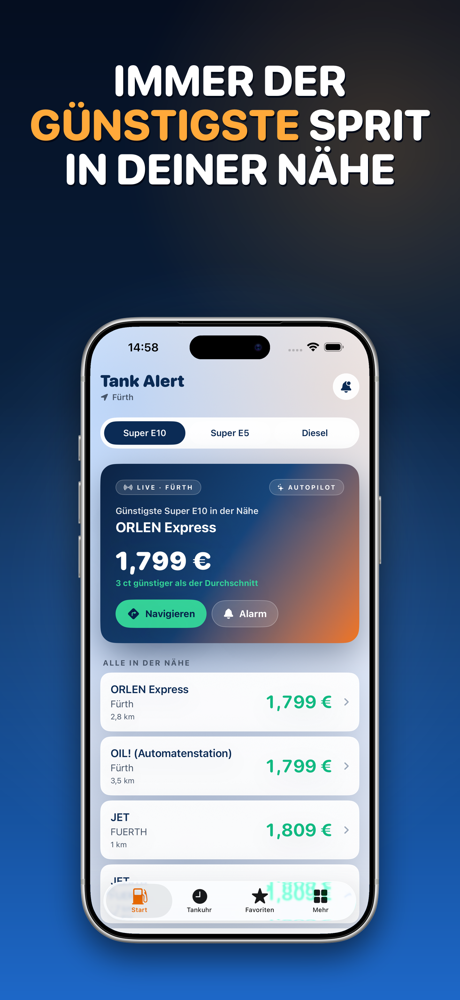
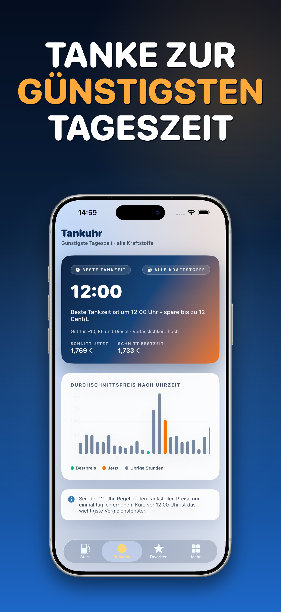
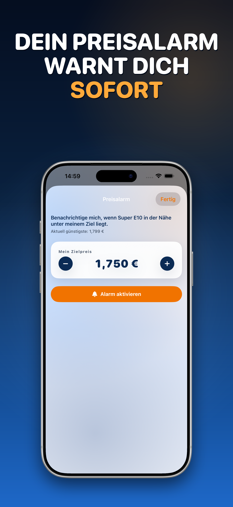

# Tank Alert

**Günstig tanken in Deutschland – live Spritpreise, Preisalarm und die beste Tankzeit.**

Finde in Sekunden die günstigste Tankstelle in deiner Nähe, setze einen Preisalarm
für E10, E5 oder Diesel und sieh mit der **Tankuhr**, wann sich das Tanken heute lohnt.
Als **Web-App** unter [tankalert.de](https://tankalert.de) und als **native iOS-App** –
kostenlos, werbefrei, mit Preisdaten von Tankerkönig.

 

 

### **[🚀 Web-App öffnen](https://tankalert.de)** · **[🌐 Website](https://tankalert.de)** · **[🐞 Fehler melden / Feature wünschen](https://github.com/onekapisch/tank-alert/issues/new/choose)**

 

<table>
  <tr>
    <td></td>
    <td></td>
    <td></td>
  </tr>
  <tr align="center">
    <td>Günstigste in der Nähe</td>
    <td>Tankuhr: beste Tankzeit</td>
    <td>Preisalarm per Push</td>
  </tr>
</table>

> [!NOTE]
> **Tank Alert ist ein kommerzielles Produkt mit geschlossenem Quellcode.** Dieses Repository
> enthält die **Doku, Release-Notes und den öffentlichen Issue-Tracker** – nicht den Quellcode der App.
> Fehlerberichte, Feature-Wünsche und Fragen sind ausdrücklich willkommen: [Issue eröffnen »](https://github.com/onekapisch/tank-alert/issues/new/choose)

## Warum Tank Alert

Die Spritpreise in Deutschland ändern sich mehrmals am Tag – Tagesschwankungen von **oft 10–15 Cent
pro Liter** sind normal (Quelle: [ADAC](https://www.adac.de/verkehr/tanken-kraftstoff-antrieb/)).
Bei einer 50-Liter-Tankfüllung sind das schnell **5–7 € Unterschied**, nur abhängig davon, *wo* und
*wann* du tankst. Wer ohne Vergleich an die nächstbeste Säule fährt, zahlt regelmäßig drauf.

Tank Alert macht aus diesem Chaos eine schnelle Entscheidung: günstigste Tankstelle in der Nähe,
ein Alarm der sich meldet wenn dein Wunschpreis erreicht ist, und eine klare Empfehlung, zu welcher
Uhrzeit sich das Tanken heute lohnt – **seit der 12-Uhr-Regel ab April 2026** wichtiger denn je.

## Was du bekommst

- 🔍 **Live-Spritsuche** – aktuelle Preise für **Super E10, E5 und Diesel** rund um deinen Standort, günstigste Station ganz oben.
- 🔔 **Smarter Preisalarm** – Wunschpreis setzen, Push- oder E-Mail-Benachrichtigung sobald eine Tankstelle in der Nähe darunter fällt. Kein ständiges Nachschauen mehr.
- ⏰ **Tankuhr** – sieh die beste Tageszeit und den günstigsten Wochentag zum Tanken, mit 24-Stunden-Verlauf statt Bauchgefühl.
- ⭐ **Favoriten & Preisverlauf** – deine Stammtankstellen im Blick, inklusive Preis-Charts der letzten Tage.
- 🧮 **Sprit-Rechner** – Spritkosten für eine Strecke berechnen und „E10 oder E5?" für dein Auto vergleichen.
- 🎨 **Farbcodierter Vergleich** – auf einen Blick erkennen, wie viel du gegenüber dem lokalen Schnitt sparst.
- 📚 **Tankwissen** – verständliche Markt-Einordnung und Quellen, damit du den fairen Preis kennst.
- 📱 **Native iOS-App** – Homescreen-Widget, CarPlay und Siri für die Dinge, die eine Website nicht kann.
- 🔒 **Datensparsam** – kostenlos, werbefrei, ohne Konto nutzbar; dein Standort dient nur der Suche, nicht dem Tracking.

## Plattformen & Datenquelle

| Plattform | Status | Voraussetzung |
|---|---|---|
| 🌐 **Web-App / PWA** ([tankalert.de](https://tankalert.de)) | ✅ Verfügbar | Aktueller Browser (Chrome, Safari, Firefox, Edge) |
| 📱 **iOS-App** (SwiftUI, nativ) | 🛠️ In Prüfung – bald im App Store | iPhone mit iOS 17 oder neuer |
| 🤖 **Android** | 💡 Geplant, wenn die Nachfrage es trägt | – |

**Datenquelle:** Alle Preise stammen von **[Tankerkönig](https://creativecommons.tankerkoenig.de)**
(Lizenz **CC BY 4.0**), basierend auf den offiziellen Meldungen der **Markttransparenzstelle für
Kraftstoffe (MTS-K)** beim Bundeskartellamt. Tank Alert ist ein unabhängiges Projekt und steht in
keiner Verbindung zu Mineralölunternehmen.

## Im Vergleich

Tank Alert nutzt dieselbe offizielle Datenbasis wie die etablierten Anbieter (**Tankerkönig / MTS-K**) –
der Unterschied liegt in **Fokus, Werbefreiheit und Datenschutz**. Eine faire Gegenüberstellung als
**Alternative zu CleverTanken, ADAC Spritpreise und Mehr-Tanken**:

| Funktion | **Tank Alert** | CleverTanken | ADAC Spritpreise | Mehr-Tanken |
|---|:---:|:---:|:---:|:---:|
| Live-Spritpreise (E10/E5/Diesel) | ✅ | ✅ | ✅ | ✅ |
| Offizielle Tankerkönig-/MTS-K-Daten | ✅ | ✅ | ✅ | ✅ |
| Preisalarm (Benachrichtigung) | ✅ | ✅ | ✅ | ✅ |
| **Tankuhr – beste Tankzeit** | ✅ | — | — | — |
| **Werbefrei** | ✅ | ✗ | ✅ | ✗ |
| Ohne Konto / Anmeldung nutzbar | ✅ | ✅ | ✅ | ✅ |
| **Keine Werbe-IDs / kein Werbe-Tracking** | ✅ | — | — | — |
| Native iOS-Features (Widget, CarPlay, Siri) | ✅¹ | teils | teils | teils |
| Kostenlos | ✅ | ✅ | ✅ | ✅ |

Stand Juni 2026, nach öffentlich verfügbaren Apps/Websites der Anbieter; Funktionen Dritter können sich ändern. „—" = kein dediziertes Feature. ¹ iOS-App in Prüfung – bald im App Store.

## Datenschutz & Sicherheit

Datenschutz ist ein Kernversprechen, kein Nachgedanke:

- **Kein Werbe-Tracking, keine Werbe-IDs, keine Datenweitergabe an Werbenetzwerke.** Dein Standort wird ausschließlich verwendet, um Tankstellen in der Nähe zu finden. Auf der Website kommt nur eine datenschutzfreundliche Reichweitenmessung **nach deiner Einwilligung** (Cookie-Banner) zum Einsatz; die iOS-App nutzt ausschließlich anonyme, DSGVO-konforme Statistik ohne Werbe-IDs.
- **Ohne Konto nutzbar.** Die Anmeldung ist optional und **passwortlos** (Magic-Link) – nur für geräteübergreifende Favoriten/Alarme. Die iOS-App funktioniert komplett ohne Konto.
- **Alle Fuel-Daten laufen über das eigene Backend**, das die Tankerkönig-Daten zwischenspeichert und schonend abfragt – Clients sprechen nie direkt mit der Quelle.

👉 Details, Datenfluss und wie du eine Sicherheitslücke meldest: **[SECURITY.md](SECURITY.md)**

## Installation

### 🌐 Web-App (PWA) – sofort nutzbar

1. **[tankalert.de](https://tankalert.de)** im Browser öffnen.
2. **Standort erlauben**, um Live-Preise in deiner Nähe zu sehen.
3. *(Optional)* Zum Homescreen hinzufügen, um Tank Alert wie eine App zu nutzen:
   - **iPhone/Safari:** Teilen-Symbol → „Zum Home-Bildschirm".
   - **Android/Chrome:** Menü (⋮) → „App installieren".
- **Aktualisieren:** Die PWA lädt die neueste Version automatisch beim nächsten Öffnen.
- **Deinstallieren:** App-Symbol entfernen bzw. Website-Daten im Browser löschen.

### 📱 iOS-App

Die native iOS-App ist **in Prüfung und erscheint in Kürze im App Store**.
Voraussetzung: iPhone mit **iOS 17 oder neuer**.
<!-- App-Store-Link nach Freigabe hier eintragen: https://apps.apple.com/de/app/... -->

> ⭐ Setz dir ein **[Watch](https://github.com/onekapisch/tank-alert/subscription)** auf dieses Repo, um den App-Store-Start nicht zu verpassen.

## Roadmap & Feedback

Die Weiterentwicklung läuft öffentlich über den Issue-Tracker. Du hast einen Bug gefunden oder
wünschst dir ein Feature?

- 🐞 **[Bug melden](https://github.com/onekapisch/tank-alert/issues/new?template=bug_report.yml)**
- 💡 **[Feature vorschlagen](https://github.com/onekapisch/tank-alert/issues/new?template=feature_request.yml)**
- 💬 **[Alle Issues ansehen](https://github.com/onekapisch/tank-alert/issues)**

## FAQ

**Ist Tank Alert wirklich kostenlos?**
Ja – vollständig kostenlos, ohne versteckte Kosten, ohne In-App-Käufe. Die iOS-App ist zusätzlich werbefrei.

**Ist Tank Alert Open Source?**
Nein. Tank Alert ist ein kommerzielles Produkt mit **geschlossenem Quellcode**. Dieses öffentliche Repo
hostet Doku, Release-Notes und den Issue-Tracker – nicht den App-Quellcode. Siehe [LICENSE](LICENSE).

**Warum Tank Alert statt CleverTanken & Co.?**
Die Preisbasis ist bei allen die gleiche (**Tankerkönig / MTS-K**). Tank Alert setzt darauf einen
**werbefreien, datensparsamen** Aufsatz mit **Tankuhr** (beste Tankzeit), klaren Preisalarmen und
nativen iOS-Features – ohne Konto-Zwang. Eine schlanke **Alternative zu CleverTanken**, wenn dir
Werbefreiheit und Datenschutz wichtig sind.

**Woher kommen die Preise – und stimmen sie?**
Direkt aus den offiziellen MTS-K-Meldungen über Tankerkönig (CC BY 4.0). Die Quelle aktualisiert
etwa alle 4–5 Minuten; Tank Alert fragt schonend und zwischengespeichert ab.

**Brauche ich ein Konto?**
Nein. Suche und Tankuhr funktionieren sofort. Ein optionales, passwortloses Konto (Magic-Link) gibt es
nur, wenn du Favoriten und Alarme geräteübergreifend synchronisieren willst. Die iOS-App kommt ganz ohne Konto aus.

---

### ⭐ Gefällt dir Tank Alert? **[Gib dem Repo einen Stern!](https://github.com/onekapisch/tank-alert)**

Es hilft anderen, eine werbefreie Spritpreis-App zu finden.

**[🚀 Web-App](https://tankalert.de)** · **[🐞 Issues](https://github.com/onekapisch/tank-alert/issues)** · **[🔒 Sicherheit](SECURITY.md)** · **[📝 Changelog](CHANGELOG.md)**

Preisdaten von <a href="https://creativecommons.tankerkoenig.de">Tankerkönig</a> · CC BY 4.0 · MTS-K / Bundeskartellamt. Tank Alert ist ein unabhängiges Projekt ohne Verbindung zu Mineralölunternehmen.

